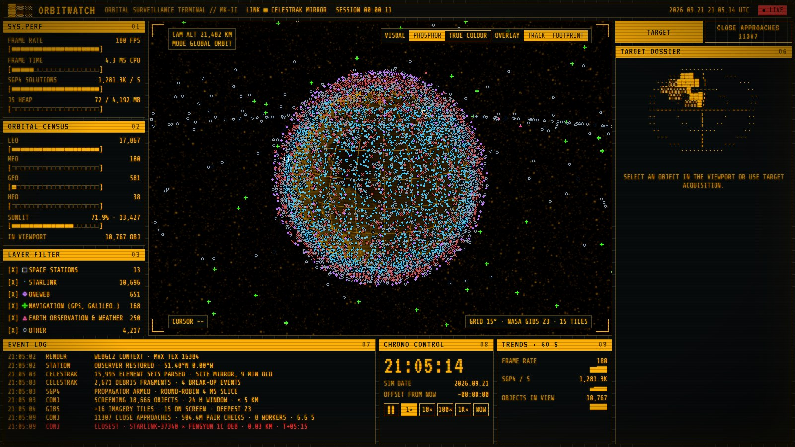
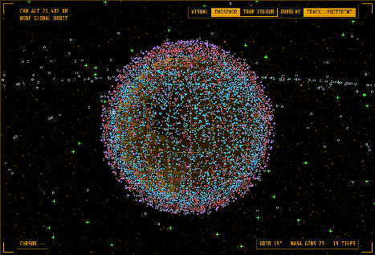
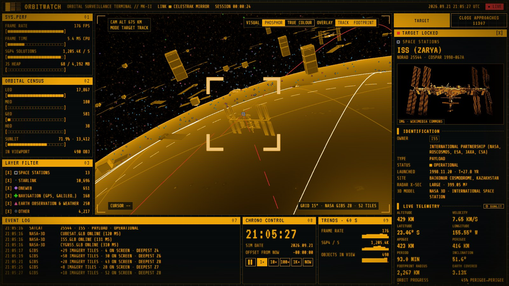
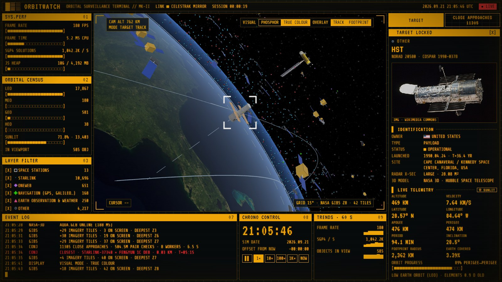
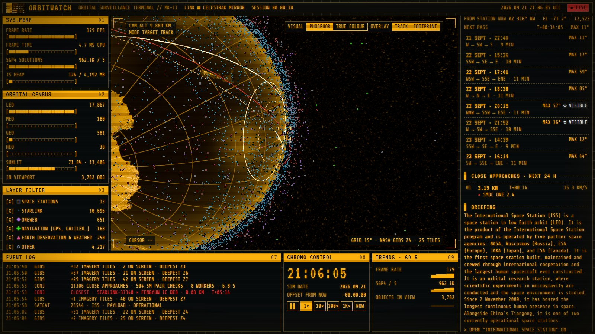
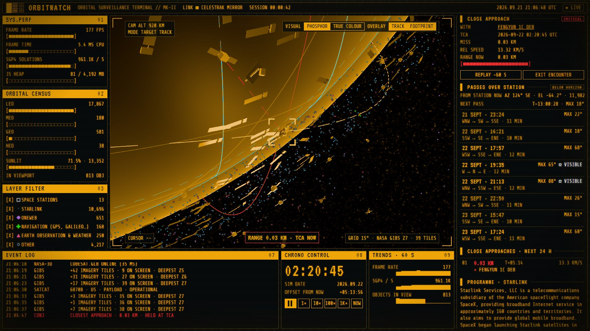
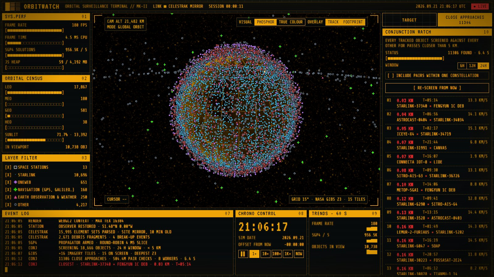

# OrbitWatch — live satellite tracker

[](https://github.com/Zachary-Malcolm/orbitwatch/actions/workflows/ci.yml)

**▶ Live: [zachary-malcolm.github.io/orbitwatch](https://zachary-malcolm.github.io/orbitwatch/)** · try the ISS: [#norad=25544](https://zachary-malcolm.github.io/orbitwatch/#norad=25544)

A real-time 3D globe showing every active satellite in orbit (~16,000 objects) plus ~2,700 debris fragments, computed in
the browser from live orbital data, presented as a 1980s amber-phosphor orbital surveillance terminal.



<p align="center">
  
</p>

| | |
|---|---|
|  |  |
| **Target dossier.** Owner, launch, status, briefing and live telemetry, with NASA's 3D model up close | **True colour.** NASA imagery streamed down to ~600 m per pixel; Hubble with its NASA model |
|  |  |
| **Ground track and passes.** Footprint rings, the track beneath the ISS, and its next passes over a station | **Close approach.** Clock held at the moment of closest approach: 30 m at 13.3 km/s |
|  | |
| **Conjunction watch.** ~18,700 objects screened pair-wise for passes under 5 km in about 6 seconds | |

## Features

- **Terminal interface**: a dense modular cockpit grid (status bar, systems column, bezelled viewport, target dossier, event log, chrono
  control) in a strict amber palette with CRT scanlines, segmented block gauges and block sparklines. Every gauge is measured, not
  simulated: frame rate and CPU time, SGP4 solutions per second, JS heap, orbit-regime census, share of satellites in sunlight, objects
  in view, API round-trip times, and NASA imagery and model streaming. The event log records real events: data fetches, target locks,
  model loads, eclipse entry and exit
- **Phosphor / true-colour display**: a post-processing pass renders the 3D scene as monochrome amber with a 15° grid on the Earth,
  keeping the target's orbit in warning red. Satellites are drawn as category glyphs (□ · ◆ ✚ ▲ ○) so they stay distinguishable
  without colour. Switch to true colour for the full NASA imagery

- **Live data** from [CelesTrak](https://celestrak.org) (two-line element sets). The deployed site serves a copy that the GitHub Pages workflow refreshes every 3 hours, so visitors never run into CelesTrak's per-IP download limit
- **Real orbital mechanics**: positions from the SGP4 propagation model via [satellite.js](https://github.com/shashwatak/satellite-js)
- **High-resolution Earth**: NASA Blue Marble imagery by day and VIIRS city lights by night, streamed as tiles from NASA GIBS down to ~600 m per pixel. It rotates with Greenwich sidereal time, has a day/night terminator from the real sun position, and shows sun glint on the oceans
- **Target dossier**: click any satellite for an intel-style panel with owner country and flag, launch date and site, operational status, radar size, a photo and briefing from Wikipedia, and live telemetry (including whether it's in sunlight or Earth's shadow)
- **Close-up tracking**: the camera flies to the selected satellite and orbits around it. Zoom in and nearby spacecraft turn from dots into 3D models: NASA models for the ISS, Hubble, Aqua, Aura, Landsat, GOES, TDRS and ~20 more missions; NASA's SSL-1300 bus for geostationary comsats and a NASA CubeSat for small sats; procedural models for Starlink, Tiangong and the rest. The dossier says which model is shown and whether it is exact or representative
- **An image for every satellite**: its own Wikipedia photo, otherwise its programme's (e.g. Starlink), otherwise one for its type of spacecraft, labelled as representative
- **Conjunction watch**: every tracked object (~16,000 satellites plus ~2,700 debris fragments from the four largest
  break-ups) is screened against every other for passes closer than 5 km over the next 6–24 hours, in parallel Web
  Workers (~6 s for 24 h on an 8-core machine). Pick an encounter to rewind the clock to just before it, watch both
  objects close in with a live range readout, and hold at the exact moment of closest approach
- **Ground track and coverage footprint**: the path traced on the ground beneath the locked target (half an orbit behind,
  one and a half ahead) and the region that can see it, above the horizon and 10° up, with footprint radius and share of
  the Earth covered. Other satellites dim while a target is locked so the overlays stay readable
- **Pass predictor**: set an observer station (device location, a click on the globe, or typed coordinates; kept only
  in the browser) to list the locked target's passes over the next 3 days, with rise/peak/set times and directions in
  local time, a countdown, and a ☼ VISIBLE flag when it can be seen with the naked eye. The station shows on the globe
  with a line-of-sight beam while the target is above its horizon, and the event log records AOS/LOS as it rises and sets
- **News uplink**: a teletype ticker of the latest spaceflight headlines, a NEWS tab, and new stories in the event log
  (polled every 5 minutes from the [Spaceflight News API](https://spaceflightnewsapi.net), ~40 outlets). Each dossier
  also shows news about that object: by its common name (the ISS, Hubble, Tiangong…), otherwise its constellation
  (e.g. the Starlink programme), and says so when an object has no coverage rather than showing unrelated stories
- **Shareable links**: `#norad=25544` opens a satellite; `#norad=A&with=B&t=<ISO time>` opens a specific close approach
- Search by name or NORAD ID, filter by constellation, and fast-forward time up to 1000×. The view starts with
  space stations, navigation and Earth observation only; the layer filter switches on Starlink, OneWeb, other
  satellites and debris
- **Timeline**: drag through the next 24 hours and watch everything move; the locked target's passes over the
  station are marked on it (brighter when visible to the naked eye), so you can drag straight to the next one.
  On phones it's in the TIME tab under the speed buttons, with a finger-sized handle
- **Phone layout**: the globe fills the screen above a tab bar, and panels open in a bottom sheet (drag to
  resize) with the globe shrinking to stay whole above it, so every change is seen as it's made. A chip on the
  globe shows the locked target with a release button, and the dossier's long sections fold away
- **Terminal sounds** (on at medium volume after the first click; `[♪]` steps through low, medium, high and off): a CRT power-on thunk, key
  clicks on every control, rising and falling blips for switches, a "target acquired" tone, a modem chirp as
  dossier data arrives, eclipse tones as the target enters and leaves Earth's shadow, AOS/LOS chimes as it rises
  and sets over the station, a countdown that quickens into an alarm at closest approach, a low sonar ping from the
  standby radar, a bell for breaking news and faint teletype chatter from the ticker. All synthesised live with
  the Web Audio API from square and triangle waves and filtered noise, no audio files
- **Boot screen**: opens on a "PRESS ANY KEY TO POWER ON" prompt (the press is what lets the browser play
  sound; [ START MUTED ] skips the sound, and muted visitors skip the prompt), then a pixel logo that flickers on, a spinning ASCII globe with satellites in orbit, a start-up log
  and a chunky segmented loading bar, then the dashboard switches on like an old television: a point of light, a
  bright line, rolling amber static and a flicker as the picture steadies. The five-second pacing is
  theatre, but every log line reports something real (this device, the catalogue that actually arrived,
  imagery tiles, news stories) and the bar can't finish until the satellite catalogue has really loaded.
  It has its own sounds: static as the logo lights, typewriter keys, a blip per [ OK ], a tick per bar segment
  that climbs two octaves as it fills, a rising arpeggio at SYSTEM READY and a zap and hum for the switch-on
- **Guided tour** for first-time visitors: a welcome card, then eight short steps that highlight each panel in turn
  and end by locking onto the ISS. It can be skipped or switched off, never appears for visitors arriving on a
  shared link, and can be replayed from the `[?]` button in the status bar

## Running locally

```bash
npm install
npm run dev        # development server
npm test           # unit tests (Vitest)
npm run typecheck  # TypeScript check
```

The README screenshots and GIF are generated from the live site by `npm run capture`, which drives a locally installed
Chrome through Playwright (see `scripts/capture-readme.mjs`).

## How it works

| File | Responsibility |
|---|---|
| `src/tle.ts` | Fetches and caches TLE data, parses it into SGP4 records, and categorises satellites |
| `src/intel.ts` | Dossier data: CelesTrak SATCAT, Wikidata (NORAD ID → article) and Wikipedia summaries |
| `src/codes.ts` | Owner-country and launch-site lookup tables (generated from CelesTrak) |
| `src/models.ts` | Chooses and places a model for every satellite near the camera; procedural fallbacks |
| `src/scene.ts` | Three.js scene: base globe, atmosphere glow, starfield, sun light, environment reflections |
| `src/earthShader.ts` | Day/night Earth shading with city lights, ocean glint and limb haze |
| `src/earthTiles.ts` | Quadtree level-of-detail streaming of NASA GIBS imagery tiles |
| `src/nasaModels.ts` | Satellite → NASA model mapping, lazy glTF loading and instancing |
| `src/groundTrack.ts` | Ground track and coverage footprint, drawn in the Earth-fixed frame |
| `src/observer.ts` | Observer station, look angles, pass prediction and visibility, globe marker and beam |
| `src/news.ts` | Latest headlines and per-object news search (Spaceflight News API) |
| `src/conjunctions.ts` | Splits close-approach screening across parallel workers and merges the results |
| `src/screening.ts` | The screening itself: grid sieve, linear closest-approach test, SGP4 refinement |
| `src/conjunctionWorker.ts` | Runs the screening in a Web Worker, off the main thread |
| `src/satellites.ts` | Satellite point cloud, propagation, screen-space picking, orbit paths |
| `src/main.ts` | Entry point: wires up the panels, runs the frame loop and loads the catalogue |
| `src/ui/context.ts` | The shared scene objects and catalogue state the panels use |
| `src/ui/clock.ts` | Simulated clock: hold, speed up, jump to a time |
| `src/ui/camera.ts` | Camera flights to and from a target, and tracking in the target's own frame |
| `src/ui/selection.ts` | Locking onto and releasing a target |
| `src/ui/dossier.ts` | Target dossier: catalogue record, briefing and live telemetry |
| `src/ui/passesPanel.ts` | Observer station controls and the pass list |
| `src/ui/conjunctionPanel.ts` | Close-approach list and screening controls |
| `src/ui/encounter.ts` | Encounter replay, held at the moment of closest approach |
| `src/ui/links.ts` | Shareable links (`#norad=…`) |
| `src/ui/newsPanel.ts` | News ticker, NEWS tab and per-object news |
| `src/ui/gauges.ts` | Measured gauges, readouts and the orbit-regime census |
| `src/ui/picking.ts`, `search.ts`, `legend.ts`, `display.ts`, `tabs.ts` | Globe clicks and hover, search, layer filter, display switches, tabs |
| `src/ui/tour.ts` | First-visit guide: welcome card and step-by-step tour of the panels |
| `src/ui/timeline.ts` | The 24-hour timeline under the clock, with pass marks |
| `src/ui/sound.ts` | Synthesised terminal sounds (Web Audio) and the sound switch |
| `src/ui/boot.ts` | The boot screen: pixel logo, ASCII globe, start-up log and loading bar |
| `src/ui/tv.ts` | The television-style switch-on from the boot screen to the dashboard |
| `src/ui/mobile.ts` | Phone layout: bottom sheet and tab bar, target chip, folding dossier sections |
| `src/terminal.ts` | Text-mode widgets: block bars, sparklines, event log, radar sweep |
| `src/telemetry.ts` | Event log bus and timed fetches for link latency |
| `test/` | Unit tests for the orbital maths (see Testing below) |

**Coordinate frame.** The scene is Earth-centred inertial (ECI), the frame SGP4 outputs. Instead of converting
every satellite to Earth-fixed coordinates each frame, the Earth mesh is rotated by sidereal time.
Orbits drawn this way are closed ellipses, as they are in reality.

**Performance.** Running SGP4 for 16k satellites every frame is too slow for 60 fps. Each frame
re-propagates a 4 ms time-boxed slice of satellites (round robin). Every other satellite moves with a
second-order Taylor step from its last exact fix: position, velocity and two-body gravitational
acceleration. The error stays below a kilometre at real-time speed, and frames take ~6 ms. When the clock
jumps by more than two minutes (dragging the timeline, or jumping to a pass or encounter) those fixes are too
old to extrapolate from, so that frame re-propagates everything at once.

**Tracking camera.** While tracking, the orbit controls pivot around the satellite, and the camera's
offset is stored in the satellite's own frame (along-track, radial, cross-track). The view of the
Earth below therefore stays fixed as the satellite orbits, while you can still drag and zoom freely.

**Model scale.** Real spacecraft would be sub-pixel at planetary scale, so models are drawn at a
fixed exaggerated size (~37 km) that never shrinks below 14 px on screen.

**Earth tiles.** Each update walks a Web-Mercator quadtree from zoom 2 to 8 and splits a tile while
one of its texels would cover more than ~1.3 screen pixels. Tiles over the horizon or outside the view
frustum are skipped, and a tile that is still downloading is replaced by its nearest loaded ancestor. A
low-resolution globe sits 6 km underneath to cover the poles and any gaps.

**Ground track and footprint.** Track points are the satellite's inertial positions rotated back by Greenwich
sidereal time at each instant and projected onto the surface, which is why successive orbits land further west.
The footprint ring's angular radius from the Earth's centre is λ = acos(cos ε / r) − ε for minimum elevation ε
and orbit radius r (in Earth radii): about 20° for the ISS and 81° from geostationary orbit.

**Pass prediction.** Elevation above the station's horizon is stepped through the next 3 days (about 180 samples per
orbit), each horizon crossing is bisected to within a second, and the peak is found by golden-section search. Passes
peaking below 10° are skipped. A pass is marked visible if, at some point, the satellite is sunlit, the Sun is more
than 6° below the station's horizon (civil twilight or darker), and the satellite is over 10° up. Slow orbits (period
over 10 hours) that never set or never rise are reported as such.

**Close-approach screening.** Every 60 s of the window, each object is propagated with SGP4 and dropped into
a 3D grid whose cells are the furthest two objects could close in half a step (5 km + 16 km/s × 30 s). Only
pairs in neighbouring cells are compared, using their straight-line relative motion over the half-step (two
nearby objects feel almost the same gravity, so their relative motion is close to straight even though each
orbit curves). Candidates are refined with a golden-section search on the exact SGP4 separation. Pairs with
under 100 m/s relative speed (docked vehicles, formation flyers) are dropped, and pairs inside one operator's
constellation are skipped by default: Starlink members are kept in a separate list per cell and never compared
with each other, which removes most of the work. The window is split into time slices screened in parallel.
Public TLEs are accurate to roughly a kilometre, so miss distances are indicative rather than operational.

## Testing

The maths is covered by [Vitest](https://vitest.dev) unit tests in `test/`, run by GitHub Actions on every push
(the deploy also refuses to publish if they fail). Where possible each result is checked against an independent
answer rather than against itself:

- **SGP4**: satellite.js reproduces Vallado's published verification states ("Revisiting Spacetrack Report #3")
  to the millimetre, and a real ISS element set gives a physically sensible orbit (altitude, speed, period,
  highest latitude equal to the inclination)
- **Pass prediction**: a day of ISS passes over Greenwich agrees with a brute-force scan of the elevation every
  second (rise and set within a second, peak never lower); rise and set sit on the horizon; geostationary
  satellites are reported as always or never visible
- **Sun**: midsummer Sun elevation over Greenwich at noon and midnight
- **Footprint**: the ISS's ~2,250 km horizon radius and a geostationary satellite's ~42% of the Earth, plus a
  vector check that the satellite really sits at the requested elevation from the edge of each ring
- **Close-approach screening**: a tiny synthetic catalogue with one crossing pair (time and distance of closest
  approach match a 50 ms brute-force search), a formation pair that must be ignored, constellation skipping
  and the distance threshold
- **Imagery tiles**: the quadtree tiles exactly, every point of a tile lies inside the cone used to cull it, and
  the texel-size estimate that drives the level of detail is within 1%

Each test was also checked against deliberately broken code (weakened searches, a removed filter) to confirm it
fails when it should.

## Credits

- Orbital elements and satellite catalogue: [CelesTrak](https://celestrak.org)
- Earth imagery: NASA [GIBS](https://www.earthdata.nasa.gov/engage/open-data-services-software/earthdata-developer-portal/gibs-api) (Blue Marble Next Generation, VIIRS Black Marble)
- Spacecraft models: [NASA 3D Resources](https://github.com/nasa/NASA-3D-Resources), compressed with glTF-Transform
- Photos and briefings: Wikipedia / Wikimedia Commons via the Wikipedia REST API and Wikidata
- Flags: [flagcdn.com](https://flagcdn.com)
- News: [Spaceflight News API](https://spaceflightnewsapi.net) by The Space Devs; headlines link to the original articles

## Roadmap ideas

- Deep-link URLs to a selected satellite
